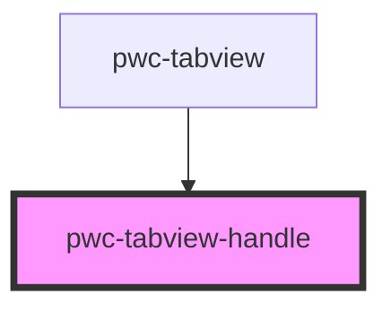

# pwc-tabview

<!-- Auto Generated Below -->

## Properties

| Property | Attribute | Description | Type                       | Default     |
| -------- | --------- | ----------- | -------------------------- | ----------- |
| `active` | `active`  |             | `boolean`                  | `undefined` |
| `tab`    | --        |             | `HTMLPwcTabviewTabElement` | `undefined` |

## Events

| Event           | Description | Type                                      |
| --------------- | ----------- | ----------------------------------------- |
| `handleClicked` |             | `CustomEvent<IHandleClickedEventPayload>` |

## Dependencies

### Used by

 - [pwc-tabview](../pwc-tabview)

### Graph

----------------------------------------------

*Built with [StencilJS](https://stenciljs.com/)*
