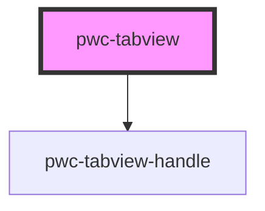

# pwc-tabview

<!-- Auto Generated Below -->

## Events

| Event        | Description                                    | Type                  |
| ------------ | ---------------------------------------------- | --------------------- |
| `tabChanged` | This is emitted when we switch to another tab. | `CustomEvent<IState>` |

## Methods

### `getActiveState() => Promise<IState>`

Returns the currently active tab, handle, and title.

#### Returns

Type: `Promise<IState>`

### `switchToTab(title: string) => Promise<void>`

Switches to a tab.

#### Returns

Type: `Promise<void>`

### `switchToTabIndex(index: number) => Promise<void>`

Switches to a tab.

#### Returns

Type: `Promise<void>`

## Dependencies

### Depends on

- [pwc-tabview-handle](../pwc-tabview-handle)

### Graph

----------------------------------------------

*Built with [StencilJS](https://stenciljs.com/)*
