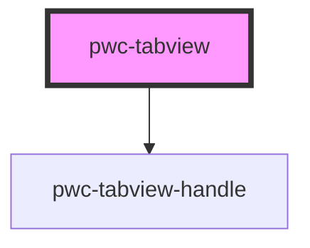

# pwc-tabview

<!-- Auto Generated Below -->

## Events

| Event        | Description | Type                                   |
| ------------ | ----------- | -------------------------------------- |
| `tabChanged` |             | `CustomEvent<ITabChangedEventPayload>` |

## Methods

### `getActiveState() => Promise<{ handle: string; tabRef: HTMLPwcTabviewTabElement; handleRef: HTMLPwcTabviewHandleElement; }>`

#### Returns

Type: `Promise<{ handle: string; tabRef: HTMLPwcTabviewTabElement; handleRef: HTMLPwcTabviewHandleElement; }>`

### `switchToTab(handle: string) => Promise<void>`

#### Returns

Type: `Promise<void>`

## Dependencies

### Depends on

- [pwc-tabview-handle](../pwc-tabview-handle)

### Graph

----------------------------------------------

*Built with [StencilJS](https://stenciljs.com/)*
